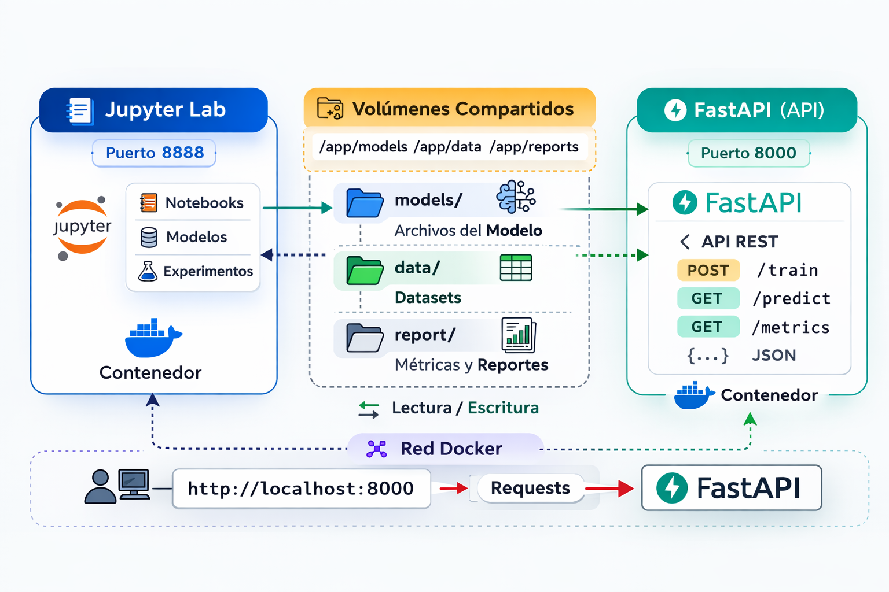
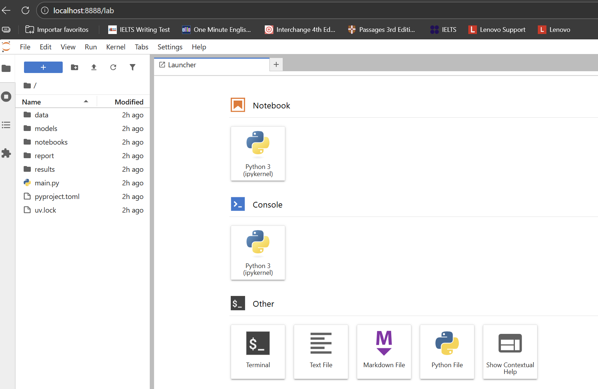
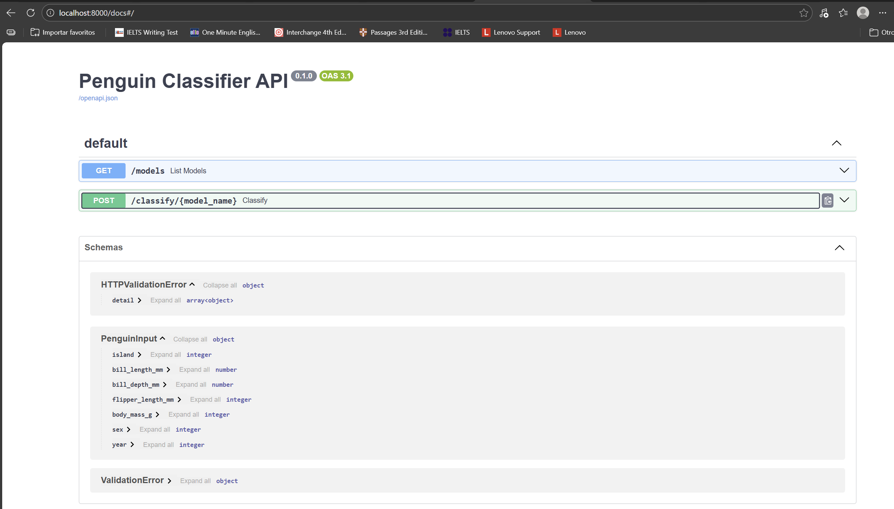
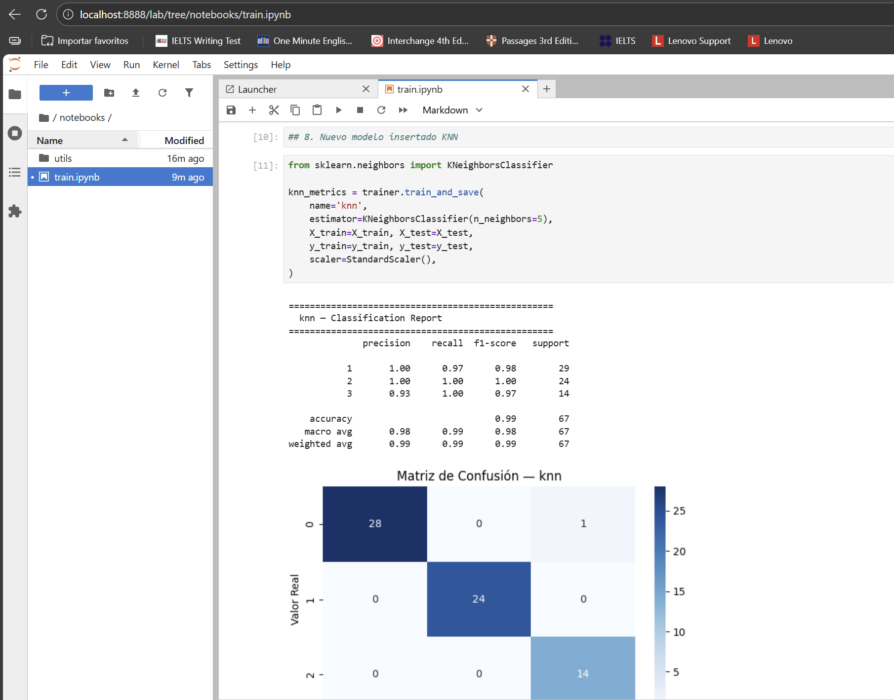
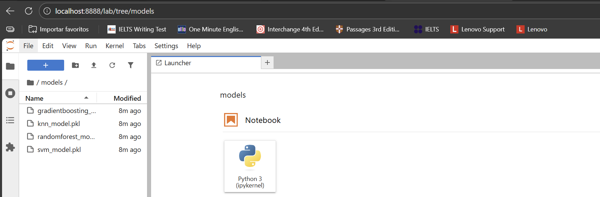
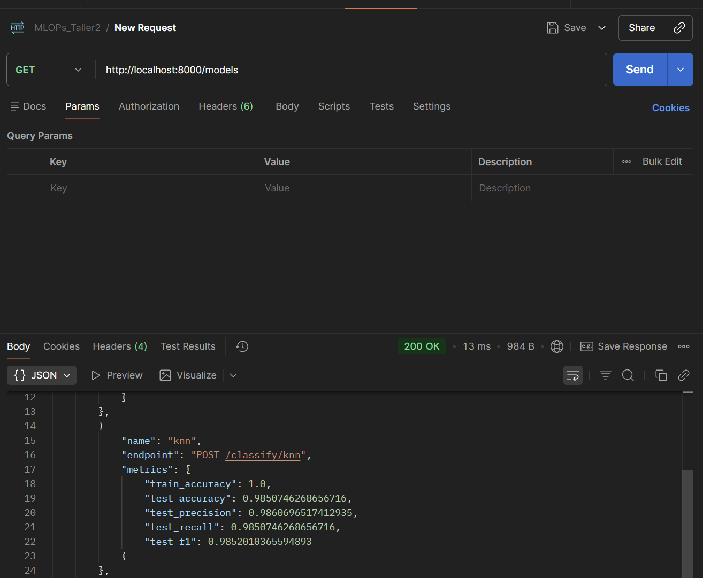
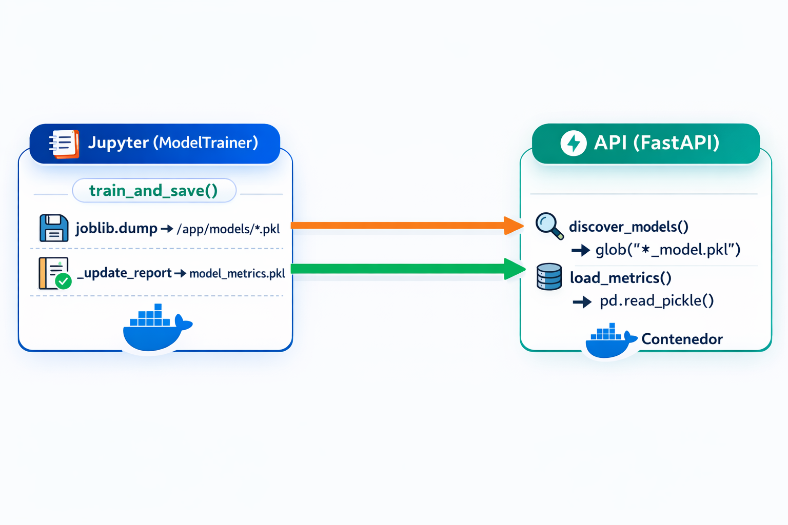
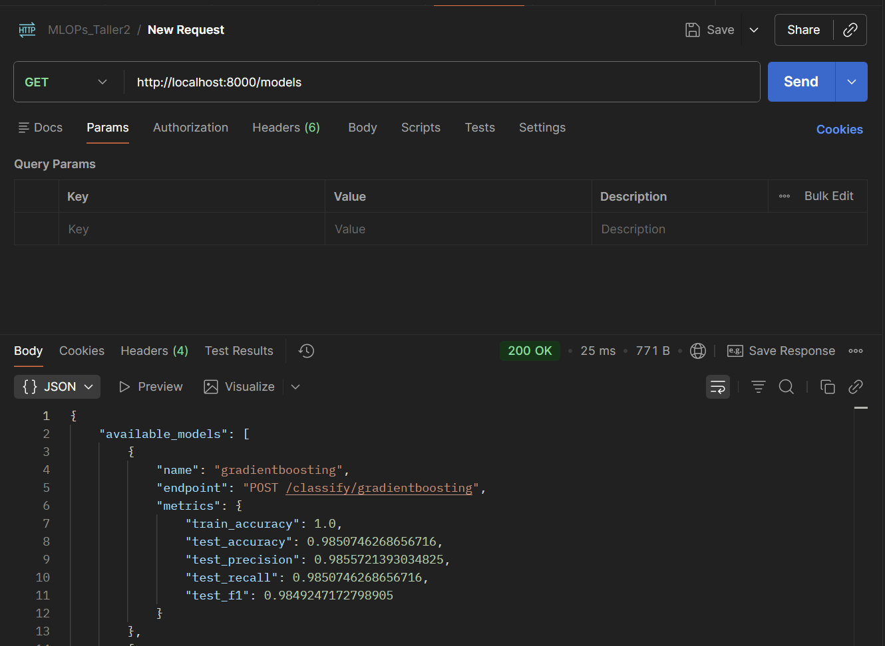
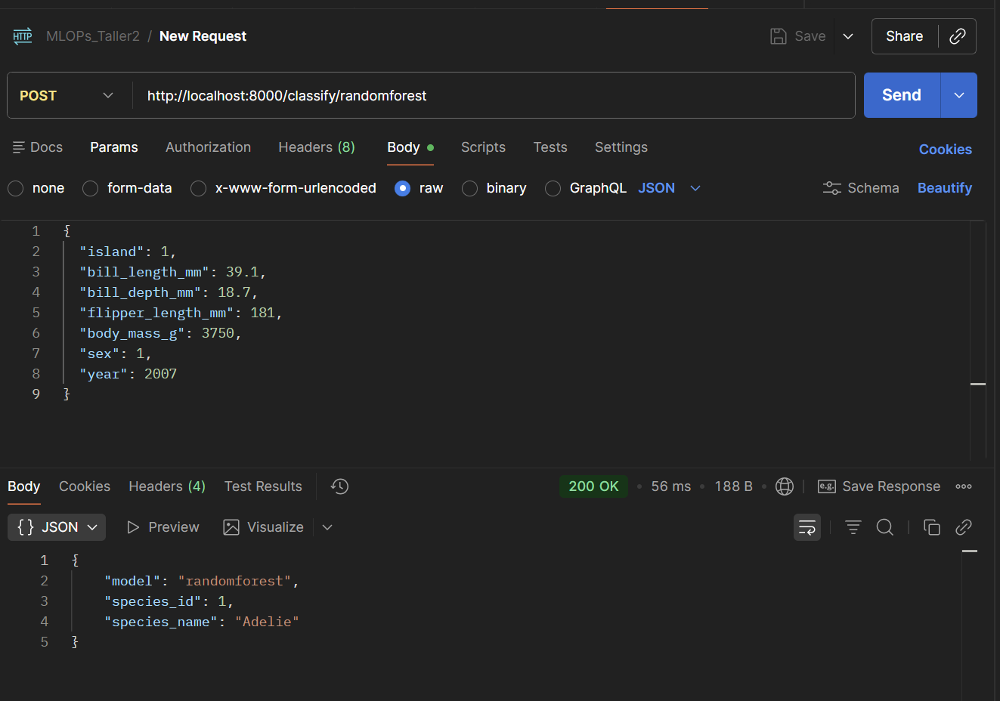

## 📚 Tabla de Contenido

- [Arquitectura](#arquitectura)
- [Estructura del Proyecto](#estructura-del-proyecto)
- [Requisitos Previos](#requisitos-previos)
- [Diseño del Docker Compose](#diseño-del-docker-compose)
  - [Contexto de build](#contexto-de-build)
  - [Servicio Jupyter](#servicio-jupyter)
  - [Servicio API](#servicio-api)
  - [Volúmenes nombrados](#volúmenes-nombrados)
  - [Dockerfile.jupyter](#dockerfilejupyter)
  - [Dockerfile.api](#dockerfileapi)
  - [Flujo de comunicación entre servicios](#flujo-de-comunicación-entre-servicios)
- [Construcción y Despliegue](#construcción-y-despliegue)
  - [1. Construir y levantar los servicios](#1-construir-y-levantar-los-servicios)
  - [2. Reconstruir solo un servicio](#2-reconstruir-solo-un-servicio)
  - [3. Detener los servicios](#3-detener-los-servicios)
  - [4. Entrenar los modelos](#4-entrenar-los-modelos)
- [Entrenamiento de Modelos — Clase `ModelTrainer`](#entrenamiento-de-modelos--clase-modeltrainer)
  - [Inicialización](#inicialización)
  - [Método principal: `train_and_save()`](#método-principal-train_and_save)
  - [Agregar un nuevo modelo](#agregar-un-nuevo-modelo)
- [Descubrimiento de Modelos y Métricas en la API](#descubrimiento-de-modelos-y-métricas-en-la-api)
  - [Descubrimiento de modelos (`discover_models`)](#descubrimiento-de-modelos-discover_models)
  - [Carga de métricas (`load_metrics`)](#carga-de-métricas-load_metrics)
  - [Flujo completo](#flujo-completo)
- [Pruebas de la API](#pruebas-de-la-api)
  - [Listar modelos disponibles](#listar-modelos-disponibles)
  - [Clasificar un pingüino](#clasificar-un-pingüino)
  - [Documentación interactiva](#documentación-interactiva)
- [Registro de Resultados (Logging de Predicciones)](#registro-de-resultados-logging-de-predicciones)
  - [Cómo funciona](#cómo-funciona)
  - [Ejemplo de una línea en predictionslog](#ejemplo-de-una-línea-en-predictionslog)
  - [Persistencia del log](#persistencia-del-log)
- [Mapeo de Variables](#mapeo-de-variables)
- [Volúmenes Compartidos](#volúmenes-compartidos)
- [Notas](#notas)


# Penguin Classifier — MLOps Taller 2

Proyecto de clasificación de especies de pingüinos usando modelos de Machine Learning, desplegado con Docker Compose. Incluye un entorno Jupyter para entrenamiento y una API FastAPI para inferencia en tiempo real.

## Arquitectura





Ambos servicios comparten volúmenes Docker para modelos, reportes, datos y resultados.

## Estructura del Proyecto

```
MLOps_Taller2/
├── API/
│   ├── app.py                          # Endpoints FastAPI
│   └── utils/
│       ├── __init__.py
│       ├── model_utils.py              # Carga de modelos, métricas, scaler
│       └── logger.py                   # Clase PredictionLogger
├── data/
│   └── penguins_v1.csv                 # Dataset de pingüinos
├── Docker/
│   ├── docker-compose.yml              # Orquestación de servicios
│   ├── Dockerfile.api                  # Imagen de la API (python:3.13-slim)
│   └── Dockerfile.jupyter              # Imagen de Jupyter (python:3.13-slim)
├── jupyter/
│   └── notebooks/
│       ├── train.ipynb                 # Notebook de entrenamiento
│       └── utils/
│           ├── __init__.py
│           └── model_trainer.py        # Clase ModelTrainer
└── README.md
```

## Requisitos Previos

- [Docker](https://docs.docker.com/get-docker/) y [Docker Compose](https://docs.docker.com/compose/install/)

## Diseño del Docker Compose

El archivo `Docker/docker-compose.yml` contiene dos servicios que se comunican a través de volúmenes compartidos.

### Contexto de build

Ambos servicios usan `context: ..` (la raíz del proyecto) como contexto de build, porque los Dockerfiles necesitan acceder a carpetas hermanas (`API/`, `data/`, `jupyter/`):

```yaml
services:
  jupyter:
    build:
      context: ..                        # raíz del proyecto
      dockerfile: Docker/Dockerfile.jupyter
  api:
    build:
      context: ..
      dockerfile: Docker/Dockerfile.api
```

Esto permite que cada Dockerfile copie archivos desde cualquier carpeta del proyecto sin necesidad de mover archivos.

### Servicio Jupyter

```yaml
jupyter:
  ports:
    - "8888:8888"
  volumes:
    - shared_models:/app/models
    - shared_report:/app/report
    - shared_data:/app/data
    - shared_results:/app/results
  environment:
    - JUPYTER_TOKEN=mlops12345
```

- Expone el puerto `8888` para acceder a Jupyter Lab desde el navegador.
- Monta 4 volúmenes para que los artefactos generados (modelos `.pkl`, métricas, logs) persistan y sean accesibles por la API.
- El token de acceso se configura vía variable de entorno.

### Servicio API

```yaml
api:
  ports:
    - "8000:8000"
  volumes:
    - shared_models:/app/models
    - shared_report:/app/report
    - shared_results:/app/results
  depends_on:
    - jupyter
```

- Expone el puerto `8000` para recibir peticiones HTTP.
- Monta los mismos volúmenes de modelos y reportes.
- `depends_on: jupyter` asegura que el contenedor de Jupyter se inicie primero, aunque no garantiza que los modelos estén entrenados — eso requiere ejecución manual del notebook.

### Volúmenes nombrados

```yaml
volumes:
  shared_models:    # Pipelines .pkl entrenados
  shared_report:    # model_metrics.pkl con métricas
  shared_data:      # Dataset penguins_v1.csv
  shared_results:   # predictions.log
```

Se usan volúmenes nombrados para:
- Persistir datos entre reinicios de contenedores (`docker-compose down` conserva los volúmenes).
- Compartir artefactos entre servicios sin exponer rutas del host.
- Limpiar todo con `docker-compose down -v` cuando se quiera empezar desde cero.

### Dockerfile.jupyter

```dockerfile
FROM python:3.13-slim
COPY --from=ghcr.io/astral-sh/uv:latest /uv /uvx /usr/local/bin/
WORKDIR /app
RUN uv init --no-readme && \
    uv add jupyterlab pandas numpy scikit-learn matplotlib seaborn joblib
COPY data/penguins_v1.csv /app/data/penguins_v1.csv
COPY jupyter/notebooks/ /app/notebooks/
RUN mkdir -p /app/models
EXPOSE 8888
CMD ["uv", "run", "jupyter", "lab", "--ip=0.0.0.0", "--port=8888", \
     "--no-browser", "--allow-root", "--NotebookApp.token=mlops12345"]
```

- Usa `uv` como gestor de paquetes.
- Copia el dataset y los notebooks dentro de la imagen para que estén disponibles sin volúmenes adicionales.
- El dataset también se monta como volumen, pero la copia en la imagen sirve como fallback.

### Dockerfile.api

```dockerfile
FROM python:3.13-slim
COPY --from=ghcr.io/astral-sh/uv:latest /uv /uvx /usr/local/bin/
WORKDIR /app
RUN uv init --no-readme && \
    uv add fastapi uvicorn scikit-learn joblib numpy pydantic pandas
COPY API/app.py /app/app.py
COPY API/utils/ /app/utils/
RUN mkdir -p /app/models /app/report /app/results
EXPOSE 8000
CMD ["uv", "run", "uvicorn", "app:app", "--host", "0.0.0.0", \
     "--port", "8000", "--reload"]
```

- Instala solo las dependencias necesarias para servir predicciones (sin matplotlib, seaborn ni jupyterlab).
- Crea los directorios que se montarán como volúmenes para evitar errores si los volúmenes están vacíos.
- `--reload` permite que uvicorn detecte cambios en `app.py` durante desarrollo.

### Flujo de comunicación entre servicios

```
1. docker-compose up --build
   ├── Construye imagen jupyter (python + jupyterlab + sklearn)
   └── Construye imagen api (python + fastapi + sklearn)

2. Jupyter arranca primero (api depends_on jupyter)

3. Usuario abre http://localhost:8888 y ejecuta train.ipynb
   └── ModelTrainer guarda pipelines en /app/models/ (volumen shared_models)
   └── ModelTrainer guarda métricas en /app/report/ (volumen shared_report)

4. API en http://localhost:8000 lee los mismos volúmenes
   └── GET /models → descubre *_model.pkl en /app/models/
   └── POST /classify/{model} → carga pipeline, predice, loguea en /app/results/
```

## Construcción y Despliegue

### 1. Construir y levantar los servicios

```bash
cd MLOps_Taller2/Docker
docker-compose up --build
```

Esto construye ambas imágenes (basadas en `python:3.13-slim` con `uv` como gestor de paquetes) y levanta:
- Jupyter Lab en `http://localhost:8888` (token: `mlops12345`)

<p align="center">
  
</p>

- API en `http://localhost:8000`

<p align="center">
  
</p>


### 2. Reconstruir solo un servicio

```bash
docker-compose up --build api       # solo reconstruye la API
docker-compose up --build jupyter   # solo reconstruye Jupyter
```

### 3. Detener los servicios

```bash
docker-compose down
```

Para eliminar también los volúmenes (modelos, reportes, etc.) y empezar desde cero:

```bash
docker-compose down -v
```

### 4. Entrenar los modelos

Una vez levantados los servicios:

1. Abrir Jupyter Lab en `http://localhost:8888` con el token `mlops12345`.
2. Abrir `notebooks/train.ipynb` y ejecutar todas las celdas.
3. `ModelTrainer` guarda los pipelines en `/app/models/` y las métricas en `/app/report/model_metrics.pkl` (volúmenes compartidos).
4. La API detecta los modelos automáticamente sin necesidad de reiniciar.

## Entrenamiento de Modelos — Clase `ModelTrainer`

El entrenamiento se centraliza en la clase `ModelTrainer` (`jupyter/notebooks/utils/model_trainer.py`), que encapsula todo el ciclo de vida de un modelo: construcción del pipeline, entrenamiento, evaluación, visualización, persistencia y actualización del reporte de métricas.

### Inicialización

```python
from utils.model_trainer import ModelTrainer

trainer = ModelTrainer(
    models_dir="/app/models",              # directorio donde se guardan los .pkl
    report_path="/app/report/model_metrics.pkl"  # archivo de métricas acumuladas
)
```

Al instanciarse, crea automáticamente los directorios si no existen (`os.makedirs`).

### Método principal: `train_and_save()`

```python
rf_metrics = trainer.train_and_save(
    name='randomforest',
    estimator=RandomForestClassifier(n_estimators=100, max_depth=10, random_state=42),
    X_train=X_train, X_test=X_test,
    y_train=y_train, y_test=y_test,
    scaler=StandardScaler(),
)
```

Este método ejecuta internamente los siguientes pasos:

1. `_build_pipeline(estimator, scaler)` — Construye un `sklearn.pipeline.Pipeline`. Si se pasa un `scaler`, lo agrega como primer paso del pipeline; luego agrega el estimador. Esto garantiza que el escalado quede integrado en el modelo serializado.

2. `pipeline.fit(X_train, y_train)` — Entrena el pipeline completo.

3. `_evaluate(pipeline, name, X_train, X_test, y_train, y_test)` — Calcula métricas sobre train y test:
   - `train_accuracy`
   - `test_accuracy`, `test_precision`, `test_recall`, `test_f1` (todas con `average="weighted"`)

4. `_show_report(pipeline, name, X_test, y_test)` — Imprime el `classification_report` de sklearn y muestra la matriz de confusión como heatmap con seaborn.

5. `joblib.dump(pipeline, "{name}_model.pkl")` — Serializa el pipeline completo (scaler + modelo) en el volumen compartido `/app/models/`.

6. `_update_report(metrics)` — Actualiza el archivo `model_metrics.pkl`:
   - Si ya existe un registro para ese modelo, lo reemplaza (permite re-entrenar sin duplicar filas).
   - Si no existe, lo agrega al DataFrame.
   - Guarda el DataFrame actualizado con `pd.to_pickle()`.

### Agregar un nuevo modelo

Solo se necesita una celda adicional en el notebook:

```python
from sklearn.neighbors import KNeighborsClassifier

knn_metrics = trainer.train_and_save(
    name='knn',
    estimator=KNeighborsClassifier(n_neighbors=5),
    X_train=X_train, X_test=X_test,
    y_train=y_train, y_test=y_test,
    scaler=StandardScaler(),
)
```
<p align="center">
  
</p>

Luego se inserta automaticamente en la carpeta de los modelos disponibles para la API

<p align="center">
  
</p>

El modelo queda disponible automáticamente en la API sin reiniciar el servicio.

<p align="center">
  
</p>

## Descubrimiento de Modelos y Métricas en la API

La API no tiene una lista hardcodeada de modelos. En su lugar, descubre dinámicamente qué modelos están disponibles y sus métricas cada vez que se hace una petición.

### Descubrimiento de modelos (`discover_models`)

La función `discover_models()` en `API/utils/model_utils.py` escanea el directorio `models/` buscando archivos que coincidan con el patrón `*_model.pkl`:

```python
def discover_models():
    pattern = os.path.join(MODELS_DIR, "*_model.pkl")
    for path in glob.glob(pattern):
        filename = os.path.basename(path)
        name = filename.replace("_model.pkl", "").lower()
        models[name] = path
    return models
```

Esto significa que:
- Cualquier archivo `{nombre}_model.pkl` que `ModelTrainer` guarde en el volumen compartido es detectado automáticamente.
- No se necesita reiniciar la API ni modificar configuración alguna.
- Si se elimina un `.pkl`, el modelo deja de aparecer en la siguiente petición.

### Carga de métricas (`load_metrics`)

La función `load_metrics()` lee el archivo `report/model_metrics.pkl` que `ModelTrainer._update_report()` mantiene actualizado:

```python
def load_metrics():
    if os.path.exists(REPORT_PATH):
        df = pd.read_pickle(REPORT_PATH)
        return {
            row["model"].lower(): {
                "train_accuracy": ...,
                "test_accuracy": ...,
                "test_precision": ...,
                "test_recall": ...,
                "test_f1": ...,
            }
            for _, row in df.iterrows()
        }
    return {}
```

Las métricas se actualizan automáticamente porque:
1. `ModelTrainer._update_report()` escribe/actualiza `model_metrics.pkl` en el volumen compartido cada vez que se entrena un modelo.
2. La API lee ese mismo archivo (a través del volumen Docker `shared_report`) en cada petición a `GET /models`.
3. Si se re-entrena un modelo, `_update_report()` reemplaza la fila anterior, así que las métricas siempre reflejan el último entrenamiento.

### Flujo completo


<p align="center">
  
</p


## Pruebas de la API

### Listar modelos disponibles

```bash
curl http://localhost:8000/models
```
<p align="center">
  
</p>
Respuesta esperada (después de entrenar):

```json
{
  "available_models": [
    {
      "name": "gradientboosting",
      "endpoint": "POST /classify/gradientboosting",
      "metrics": { "train_accuracy": 1.0, "test_accuracy": 0.98, ... }
    },
    {
      "name": "randomforest",
      "endpoint": "POST /classify/randomforest",
      "metrics": { ... }
    },
    {
      "name": "svm",
      "endpoint": "POST /classify/svm",
      "metrics": { ... }
    }
  ]
}
```
<p align="center">
  
</p>


### Clasificar un pingüino

```bash
curl -X POST http://localhost:8000/classify/randomforest \
  -H "Content-Type: application/json" \
  -d '{
    "island": 1,
    "bill_length_mm": 39.1,
    "bill_depth_mm": 18.7,
    "flipper_length_mm": 181,
    "body_mass_g": 3750,
    "sex": 1,
    "year": 2007
  }'
```

Respuesta:

```json
{
  "model": "randomforest",
  "species_id": 1,
  "species_name": "Adelie"
}
```
<p align="center">
  
</p>

### Documentación interactiva

FastAPI genera documentación Swagger automáticamente en `http://localhost:8000/docs`.

## Registro de Resultados (Logging de Predicciones)

La API registra automáticamente cada predicción usando la clase `PredictionLogger` (`API/utils/logger.py`).

### Cómo funciona

```python
class PredictionLogger:
    def __init__(self, results_dir="results", filename="predictions.log"):
        # Crea el directorio y configura un FileHandler dedicado

    def log(self, input_data: dict, result: dict):
        # Escribe una línea JSON con timestamp, input y resultado
```

Se instancia una vez al iniciar la API:

```python
pred_logger = PredictionLogger()
```

Y se invoca en cada predicción exitosa:

```python
pred_logger.log(data.model_dump(), result)
```

### Ejemplo de una línea en predictions.log

```json
{
  "timestamp": "2025-01-15T14:32:01.123456",
  "input": {
    "island": 1,
    "bill_length_mm": 39.1,
    "bill_depth_mm": 18.7,
    "flipper_length_mm": 181,
    "body_mass_g": 3750,
    "sex": 1,
    "year": 2007
  },
  "result": {
    "model": "randomforest",
    "species_id": 1,
    "species_name": "Adelie"
  }
}
```

### Persistencia del log

El archivo `predictions.log` se almacena en el volumen Docker `shared_results`, montado en `/app/results/` dentro del contenedor de la API. Esto significa que:

- El log sobrevive a reinicios del contenedor (`docker-compose down` + `up`).
- Se pierde solo si se eliminan los volúmenes explícitamente (`docker-compose down -v`).
- Cada predicción se escribe inmediatamente al archivo (no hay buffer), lo que garantiza que no se pierden registros ante un crash del contenedor.

## Mapeo de Variables

| Campo | Tipo | Rango / Valores |
|---|---|---|
| island | int | 1, 2, 3 |
| bill_length_mm | float | 10.0 – 100.0 |
| bill_depth_mm | float | 5.0 – 35.0 |
| flipper_length_mm | int | 100 – 300 |
| body_mass_g | int | 1000 – 10000 |
| sex | int | 0 (hembra), 1 (macho) |
| year | int | 2000 – 2030 |

Especies: `1` = Adelie, `2` = Chinstrap, `3` = Gentoo

## Volúmenes Compartidos

| Volumen | Jupyter | API | Contenido |
|---|---|---|---|
| shared_models | /app/models | /app/models | Archivos .pkl de modelos |
| shared_report | /app/report | /app/report | model_metrics.pkl |
| shared_data | /app/data | — | penguins_v1.csv |
| shared_results | /app/results | /app/results | predictions.log |

## Notas

- La API carga modelos dinámicamente: cualquier archivo `*_model.pkl` en el volumen de modelos es detectado sin reiniciar el servicio.
- Las predicciones se registran en `results/predictions.log` con timestamp, input y resultado.
- Si la API se levanta sin modelos entrenados, `GET /models` retorna una lista vacía y `POST /classify/{model}` retorna 404.


## 👥 Colaboradores

- 🧑‍💻 **Camilo Cortés** — [](https://github.com/cccortesh95)
- 🧑‍💻 **Johnny Castañeda** — [](https://github.com/Johnny-Castaneda-Marin)
- 🧑‍💻 **Benkos Triana** — [](https://github.com/BenkosT)
